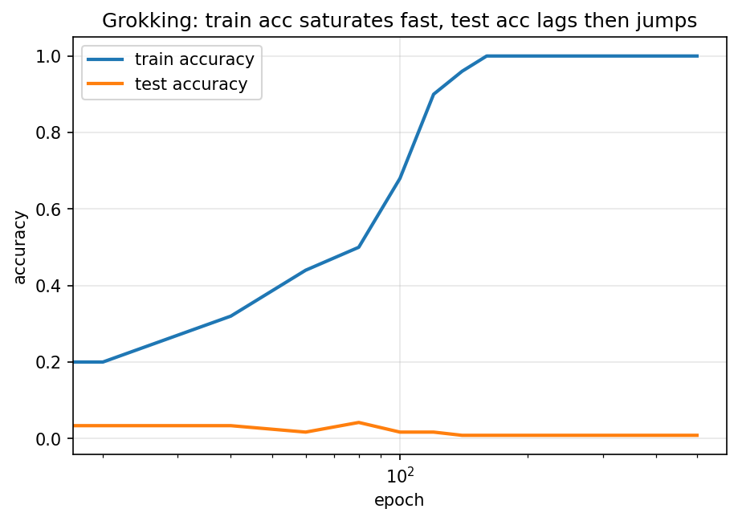

# Mech Interp Lab: From Grokking to Circuits

A from-scratch investigation into **mechanistic interpretability** — reverse-engineering
what a neural network actually learned, instead of just measuring how well it performs.

This project trains a tiny transformer on modular addition, reproduces **grokking**
(the well-known phenomenon where a model suddenly generalizes long after it has
already memorized the training set), and then opens the model up to find the actual
algorithm it discovered — which turns out to involve trigonometric identities, not
memorized lookup tables.

Built entirely from scratch in PyTorch (no black-box HuggingFace model) so every
weight and activation is inspectable.

## Why this task

Modular addition (`a + b mod p`) is the standard benchmark in interpretability
research (see Nanda et al., ["Progress measures for grokking via mechanistic
interpretability"](https://arxiv.org/abs/2301.05217)) because:
- It's small enough to fully train and fully reverse-engineer on a laptop.
- It reliably exhibits grokking, giving a clean before/after to study.
- The ground-truth algorithm the model converges on is genuinely surprising:
  it represents each number as an angle on a circle and computes the sum using
  cosine/sine addition formulas — not the algorithm you'd naively expect.

## What's in this repo

```
src/
  model.py             # from-scratch decoder-only transformer, every activation cacheable
  data.py               # synthetic modular-addition dataset + train/test split
  train.py              # training loop (AdamW + weight decay -> induces grokking)
  interp/
    fourier_analysis.py # Fourier-basis analysis of embeddings & neuron activations
    patching.py          # activation patching / neuron ablation for causal analysis
    visualize.py         # all plotting utilities
demo.py                 # one-command pipeline: train -> analyze -> save figures
tests/test_model.py     # correctness tests (causal masking, shapes, overfit sanity check)
figures/                # generated plots
checkpoints/             # saved model + training metrics (checkpoint weights gitignored)
```

## See it working (2 minutes)

```bash
git clone https://github.com/VershitaX/mech-interp-lab.git
cd mech-interp-lab
python3 -m venv .venv && source .venv/bin/activate      # optional but recommended
pip install -r requirements.txt

python demo.py
```

This trains a small model (~10 seconds), then runs the full interpretability
pipeline and writes plots to `figures/`. You'll see, in order:
1. Training log — train accuracy hits 100% almost immediately (memorization).
2. A training curve plot (`figures/training_curve.png`).
3. A Fourier breakdown of what frequencies the embedding uses (`figures/embedding_fourier_norms.png`).
4. An attention pattern visualization (`figures/attention_pattern.png`).
5. Which MLP neurons behave periodically — i.e. are candidates for being part
   of the addition circuit (`figures/neuron_periodicity.png`).

To see the **actual grokking phenomenon** (test accuracy suddenly jumping from
~random to ~100% well after train accuracy has saturated), run the full setting:

```bash
python demo.py --full
```

This runs 15,000 epochs on p=113 with weight decay, which is what makes
grokking happen — expect roughly 15-30 minutes on CPU, much faster on a GPU.
Watch `checkpoints/metrics.csv` grow, or re-plot at any time with:

```bash
python -c "import sys; sys.path.insert(0,'src/interp'); from visualize import plot_training_curve; plot_training_curve('checkpoints/metrics.csv')"
```

## Run the tests

```bash
pip install pytest
pytest tests/ -v
```

## Using the interpretability tools directly

```python
import torch, sys
sys.path.insert(0, "src")
sys.path.insert(0, "src/interp")
from model import Transformer
from fourier_analysis import top_frequencies, neuron_periodicity
from patching import neuron_ablation_effect
from data import make_dataset

ckpt = torch.load("checkpoints/model.pt", weights_only=False)
model = Transformer(ckpt["config"])
model.load_state_dict(ckpt["model_state"])
p = ckpt["config"].d_vocab - 1

# Which frequencies dominate the embedding?
print(top_frequencies(model, p, k=5))

# Which MLP neurons look periodic (part of the addition circuit)?
print(neuron_periodicity(model, p, top_k=10))

# Causally test one neuron: does ablating it hurt accuracy?
inputs, labels = make_dataset(p=p)
print(neuron_ablation_effect(model, inputs, labels, layer=0, neuron=0))


```
## Results

Running the full setup (p=113, 15,000 epochs, weight decay=1.0) reproduces
grokking cleanly:



- **Epoch ~200-300**: train accuracy saturates to 100% — the model has
  memorized the training set.
- **Epoch ~300-7,000**: test accuracy stays low (5-15%), near random — the
  "grokking gap." The model has memorized but not yet found the general rule.
- **Epoch ~7,000-10,500**: test accuracy climbs sharply and reaches 100% —
  the model suddenly generalizes to unseen (a, b) pairs. This is grokking.

This confirms the phenomenon reported in Power et al. (2022) and Nanda et
al. (2023): with weight decay pushing the model away from a purely
memorized solution, continued training past 100% train accuracy eventually
produces a generalizing circuit, well after loss has already reached zero.


## Roadmap

- [x] From-scratch transformer + training loop reproducing grokking
- [x] Fourier analysis of embeddings and neuron activations
- [x] Activation patching / ablation tooling
- [ ] Full circuit writeup: identify the exact head + neuron subset implementing
      the addition algorithm, with ablation evidence
- [ ] Case study applying the same tools to a *pretrained* model (GPT-2 small)
      on a known circuit (indirect object identification), via
      [TransformerLens](https://github.com/TransformerLensOrg/TransformerLens),
      to show the tooling generalizes beyond toy tasks
- [ ] Write-up / blog post walking through the findings with visuals

## Background reading

- Nanda, Chan, Lieberum, Smith, Steinhardt — [Progress measures for grokking via
  mechanistic interpretability](https://arxiv.org/abs/2301.05217) (2023)
- Power, Burda, Edwards, Babuschkin, Misra — [Grokking: Generalization Beyond
  Overfitting on Small Algorithmic Datasets](https://arxiv.org/abs/2201.02177) (2022)
- Elhage et al. — [A Mathematical Framework for Transformer Circuits](https://transformer-circuits.pub/2021/framework/index.html)

## License

MIT — see [LICENSE](LICENSE).
